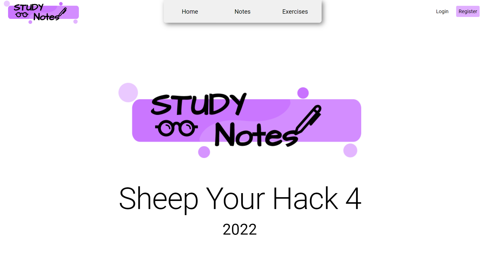
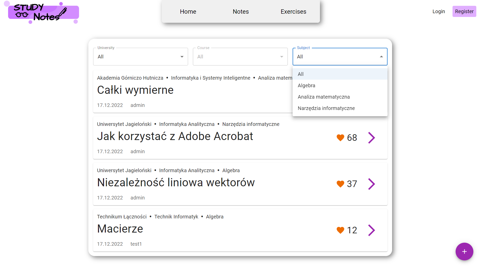
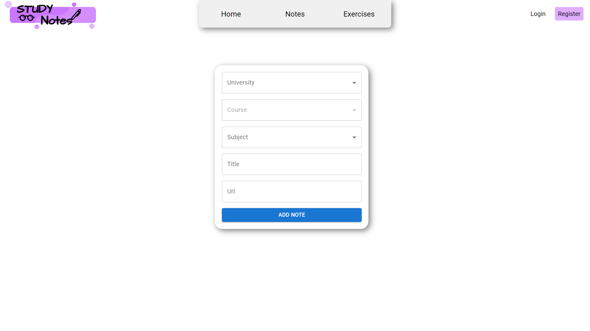
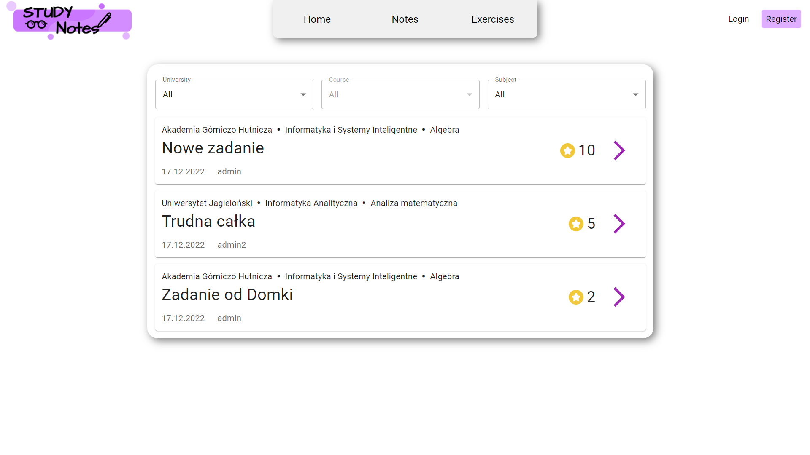

# Study Notes

 

**Study Notes** is our solution for knowledge sharing among students. Upload your own notes, gain points by receiving likes and spend them on unlocking additional notes or place a bounty on a challenging problem you would like others to solve.
 
## Motivation
Study Notes was created at the 4th edition of [SheepYourHack](https://sheepyourhack.com/) Hackathon.

- Topic: **Savings**
- Timeframe: 16-17 December 2022, 24 hours

## Features

- Registration and Login
- Browse Notes and Questions with filters
- Submit your own Notes

## Tech Stack

### Client

### Server

## Screenshots

## Authors

- [@BPajda](https://github.com/BPajda)
- [@MBrosik](https://github.com/MBrosik)
- [@MSiorr](https://github.com/MSiorr)
- [@rjodlowski](https://github.com/rjodlowski)
- [@rubikon02](https://github.com/rubikon02)
- [@Spookyless](https://github.com/Spookyless)

## License

Both the server and client repositories have their own licenses. Visit each repository's page to learn more about them.

## Acknowledgements

 - [Wyższa Szkoła Ekonomii i Informatyki](https://wsei.edu.pl/) for organizing the whole event and heartwarming welcome
